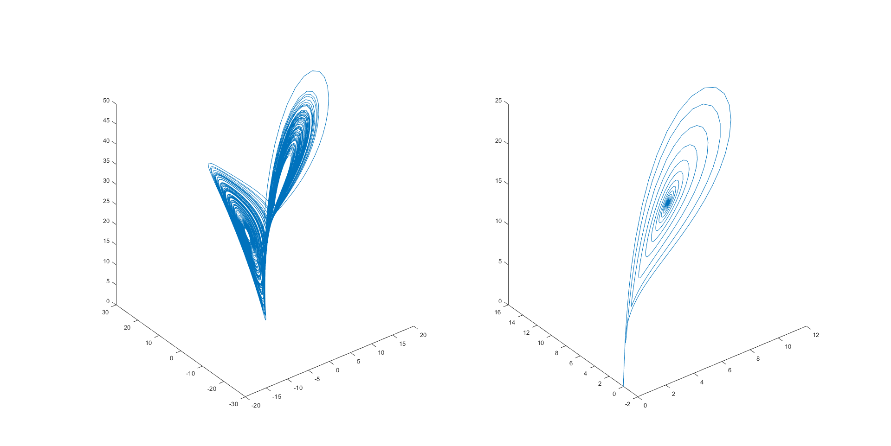

- 找出数组中所有绝对值大于3的元素。

代码

```matlab
% ex1_1.m
A = [-4, -2, 0, 2, 4;...
     -3, -1, 1, 3, 5];
ans = find(abs(A)>3)
[x_index, y_index] = find(abs(A)>3)
```

结果

```matlab
ans =
     1
     9
    10
x_index =
     1
     1
     2
y_index =
     1
     5
     5
```

- **解方程初值为[0,10-10,0]，t=[0,100s]，方程参数设置成以下两组不同的值，在三维空间上画出解轨线**

代码

```matlab
% ex1_2.m
x0 = [0. 1e-10, 1];
tao = [10, 8]; b = [8/3, 3]; r = [28, 15];
[~, X1] = ode45(@equation_set, [0, 100], x0, [], tao(1), b(1), r(1));
[~, X2] = ode45(@equation_set, [0, 100], x0, [], tao(2), b(2), r(2));

subplot(1, 2, 1);plot3(X1(:,1), X1(:,2), X1(:,3));
subplot(1, 2, 2);plot3(X2(:,1), X2(:,2), X2(:,3));
```

```matlab
% equation_set.m
function dx = equation_set(t, x, tao, b, r)
dx =[-tao * x(1) + tao * x(2);...
     r * x(1) - x(2) - x(1) * x(3);...
     x(1) * x(2) - b * x(3)];
end
```

结果



- **产生均值为2，方差为0.1的10 ×10正态分布随机阵，然后统计其中大于1.8，小于2.1的元素个数。**

代码

```matlab
% ex1_3.m
matrix = 2 + sqrt(0.1) * rand(10);
B = matrix > 1.8 & matrix <2.1;
number = sum(sum(B))
```

结果

```matlab
number =
    36
```

- **曲线拟合**

代码

```matlab
% ex1_4.m
X = [0, 1, 2, 3, 4, 5, 6, 10, 12, 15, 16];
Y = [1, 7, 23, 109, 307, 400, 307, 123, 69, 24, 6];

Fit4 = polyfit(X, Y, 4);
Formula4 = poly2str(Fit4, 'X');
Y4 = polyval(Fit4, X);
Fit5 = polyfit(X, Y, 5);
Formula5 = poly2str(Fit5, 'X');
Y5 = polyval(Fit5, X);
Fit6 = polyfit(X, Y, 6);
Formula6 = poly2str(Fit6, 'X');
Y6 = polyval(Fit6, X);
Fit7 = polyfit(X, Y, 7);
Formula7 = poly2str(Fit7, 'X');
Y7 = polyval(Fit7, X);
plot(X, Y, 'o', X, Y4, 'm--.', X, Y5, 'k-.', X, Y6, 'r-', X, Y7, 'b:');

legend('data', 'poly4', 'poly5', 'poly6', 'poly7');
xlim([0,16]);
ylim([0,400]);
```

