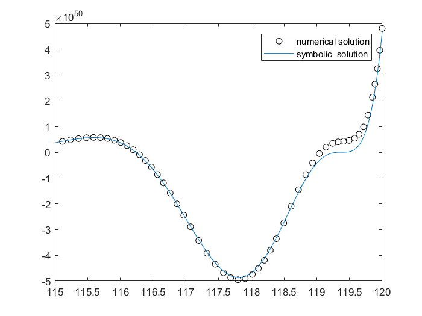

- **对符号矩阵A=[2x, t * t; tsin(x), e^x]分别计算对dxdt的二次积分和求导**

代码

```matlab
% ex2_1.m
syms x t;
A = sym('[2 * x, t * t; t * sin(x), e^x]');
ans1 = int(int(A, x), t)
ans2 = diff(diff(A, x), t)
```

结果

```matlab
ans1 =
[           t*x^2,      (t^3*x)/3]
[ -(t^2*cos(x))/2, (e^x*t)/log(e)]
ans2 =
[      0, 0]
[ cos(x), 0]
```

- **求三元非线性方程的解**

代码

```matlab
% ex2_2.m
equ1 = sym('x^2 + 2 * x + 1 = 0');
equ2 = sym('x + 3 * z = 4');
equ3 = sym('y * z = -1');
[x, y, z] = solve(equ1, equ2, equ3)
```

结果

```
x =
-1
y =
-3/5
z =
5/3
```

- **请验证三角等式 )**

代码

```matlab
% ex2_3.m
left = sym('sin(phi_1) * cos(phi_2) - cos(phi_1) * sin(phi_2)');
right = simplify(left)
```

结果

```matlab
right =
sin(phi_1 - phi_2)
```

- **求级数和^2} \quad \dfrac{(-1)^k}{k}] )，保留20位有效位。**

代码

```matlab
% ex2_4.m
syms k;
M = [1/(2 * k - 1)^2 (-1)^k/k];
ans = symsum(M, k, 1, inf);
vpa(ans, 20)
```

结果

```
ans =
[ 1.2337005501361698274, -0.69314718055994530942]
```

- **求解微分方程$ xy'' - 3y' = x^2 $其中，$ y'', y' $是关于x的导数，若设$ y(1) = 0, y(5) = 0 $，请求解。**

代码

```matlab
% ex2_5.m
syms x y;
y = dsolve('D2y * x - Dy * 3 = x^2', 'y(1) = 0', 'y(5) = 0', 'x')
```

结果

```
y =
(31*x^4)/468 - x^3/3 + 125/468
```

- **分别求方程$ y'' - 2y' + 5y = e^x \sin(x) $的精确解和数值解，并在区间x=[115,120]进行两种解的比较，画出比较图。**

代码

```matlab
% ex2_6.m
equ = 'D2y - 2 * Dy + 5 * y = exp(x) * sin(x)';
f = dsolve(equ, 'Dy(0) = 0', 'y(0) = 0', 'x')
[x, y] = ode45(@equfun, [0, 120], [0, 0]);
plot(x, y(:,1), 'ok');
hold on
fplot(f)
xlim([115, 120]);
legend('numerical solution','symbolic  solution')

% equfun.m
function dy = equfun(x, y)
dy = zeros(2, 1);
dy(1) = y(2);
dy(2) = 2 * y(2) - 5 * y(1) + exp(x) * sin(x);
end
```

结果

