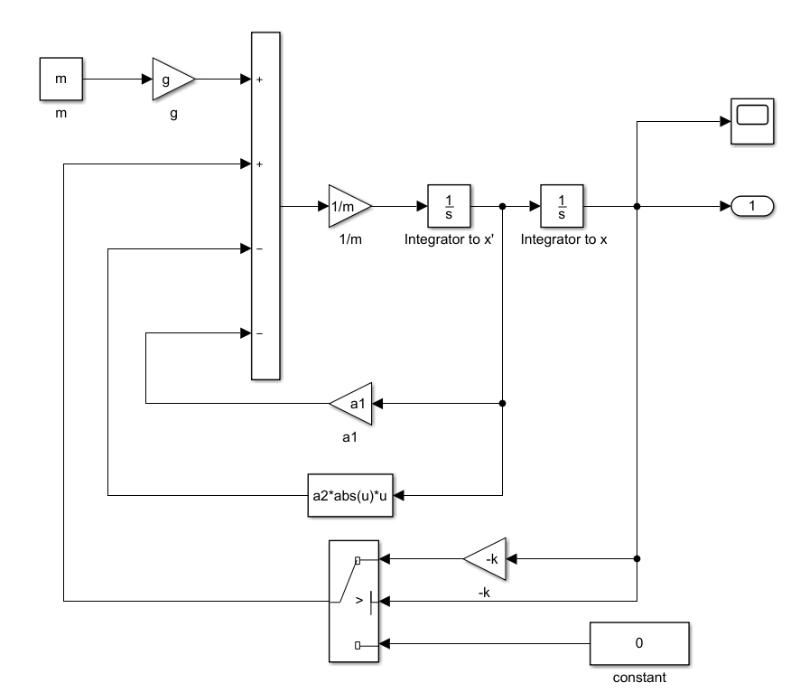
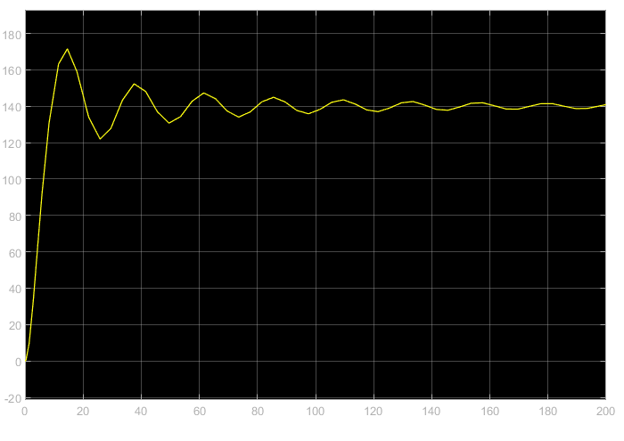
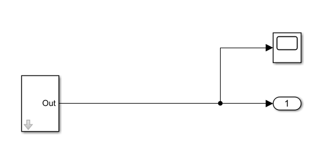
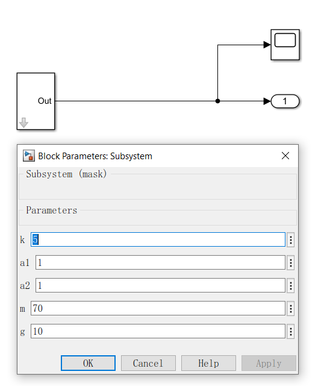
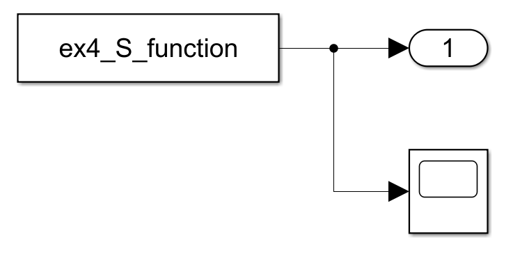
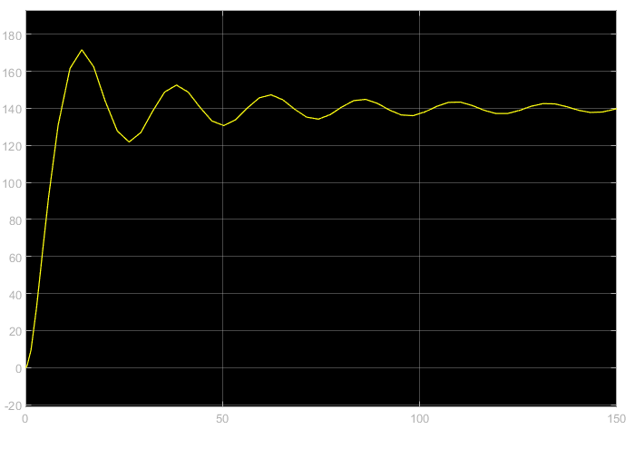

### ex4_week12

> run in R2018b

- 运用simulink，求解以下微分方程


其中，当时，，当时，。

参数配置：

画出simulink模型框图，并将结果画图。

**框图**



**结果（仿真T=200.0）**



- 将第一题的微分方程求解模型进行子系统封装，画出模型图，展示参数配置对话框。

**框图**



**参数设置**



- 试用构造S-函数方法，求解第一题的微分方程，将模型图画出，并展示S-函数的M文件的内容（文件中的注释语句请去掉），其求解结果请画图，并与第一题求解结果进行对比。

**代码**

```matlab
function [sys,x0,str,ts,simStateCompliance] = ex4_S_function(t,x,u,flag,k,a1,a2,g,m)
k = 5; a1 = 1; a2 = 1; g = 10; m = 70;
switch flag
    case 0
        [sys,x0,str,ts,simStateCompliance] = mdlInitializeSizes;
    case 1
        sys = mdlDerivates(t,x,u,k,a1,a2,g,m);
    case 2
        sys = mdlUpdate(t,x,u);
    case 3
        sys = mdlOutputs(t,x,u);
    case 4
        sys = mdlGetTimeOfNextVarHit(t,x,u);
    case 9
        sys = mdlTerminate(t,x,u);
    otherwise
        error('wrong')
end

    function [sys,x0,str,ts,simStateCompliance] = mdlInitializeSizes
        sizes = simsizes;
        sizes.NumContStates = 2;
        sizes.NumDiscStates = 0;
        sizes.NumOutputs = 1;
        sizes.NumInputs = 0;
        sizes.DirFeedthrough = 0;
        sizes.NumSampleTimes = 1;
        sys=simsizes(sizes);
        x0 = [0];
        str = [];
        ts = [0 0]; % 适用于连续系统
        simStateCompliance = 'UnknownSimState';
    end

    function sys = mdlDerivates(t,x,u,k,a1,a2,g,m)
        k = 5; a1 = 1; a2 = 1; g = 10; m = 70;
        if x(1) > 0
            f = -k*x(1);
        else
            f = 0;
        end
        dx = x(2);
        ddx = g + 1/m * (f - a1*x(2) - a2*abs(x(2))*x(2));
        sys = [dx;ddx];
    end

    function sys = mdlOutputs(t,x,u)
        sys = x(1);
    end

    function sys=mdlUpdate(t,x,u)
        sys = [];
    end

    function sys=mdlTerminate(t,x,u)
        sys = [];
    end
end
```

**框图**



**结果（仿真T=150.0）**

