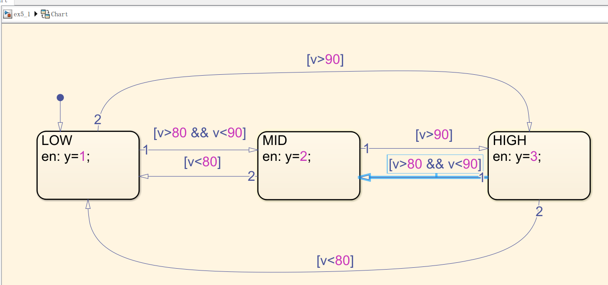
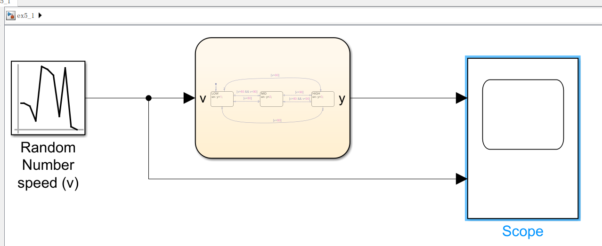
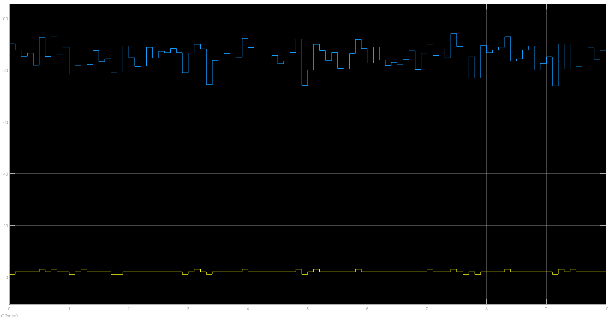
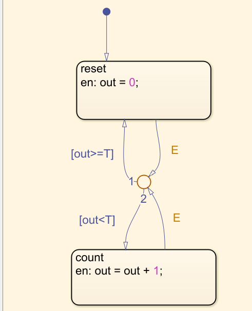
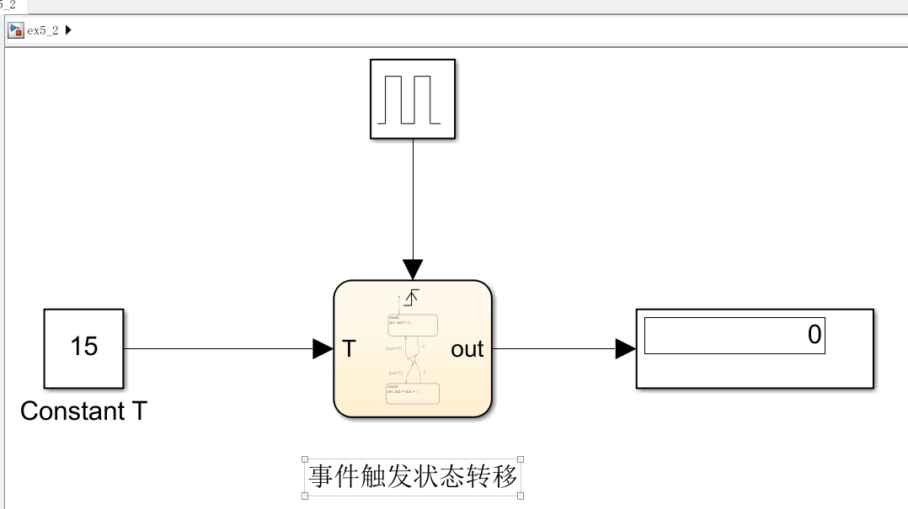
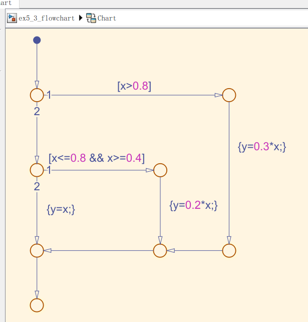
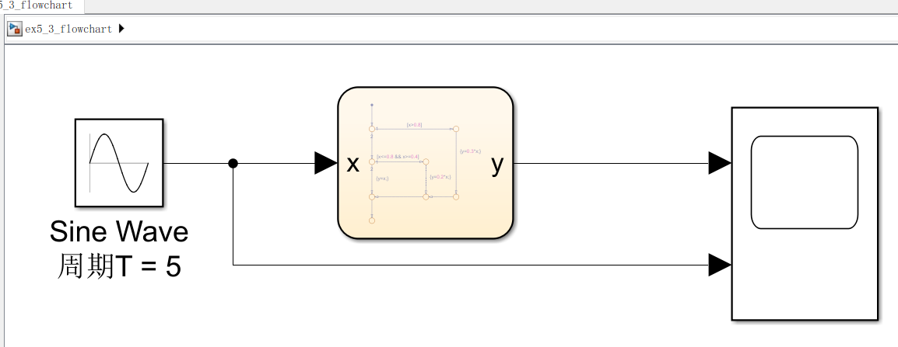
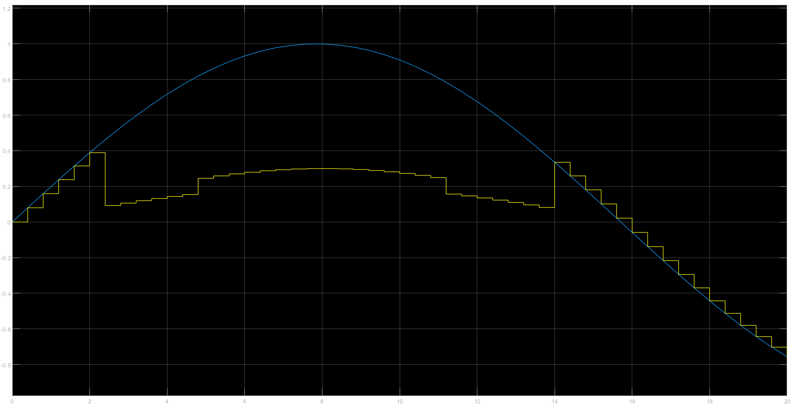

### ex5_week14

> run in R2018b

- **汽车车速控制为三个档次：车速小于80km/h、车速在80km/h和90km/h之间，车速大于90km/h，不同档次分别用1、2、3标识。假定汽车车速随机变化，请输出汽车车速的不同档次。**

**框图**

**结果**

- **请用stateflow设计一个定时器。**
  **（提示：外部输入定时器的定时时间，事件触发状态迁移，状态可以分为两个：复位（到达定时时间）、计时（未到达定时时间）。）**

**框图**

- **请用stateflow流程图实现下面函数。**

$$
y=\left\{\begin{array}{ll}{0.3 x} & {x>0.8} \\ {0.2 x} & {0.4 \leq x \leq 0.8} \\ {x} & \rm{others}\end{array}\right.
$$

**x为自定义正弦输入。**

**框图**

**结果**

